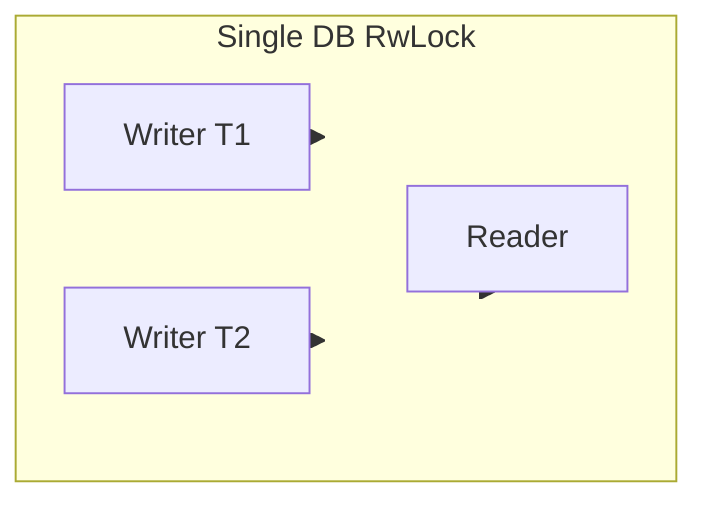
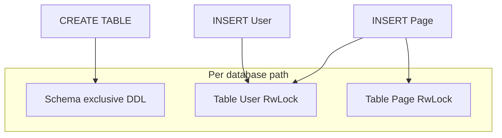
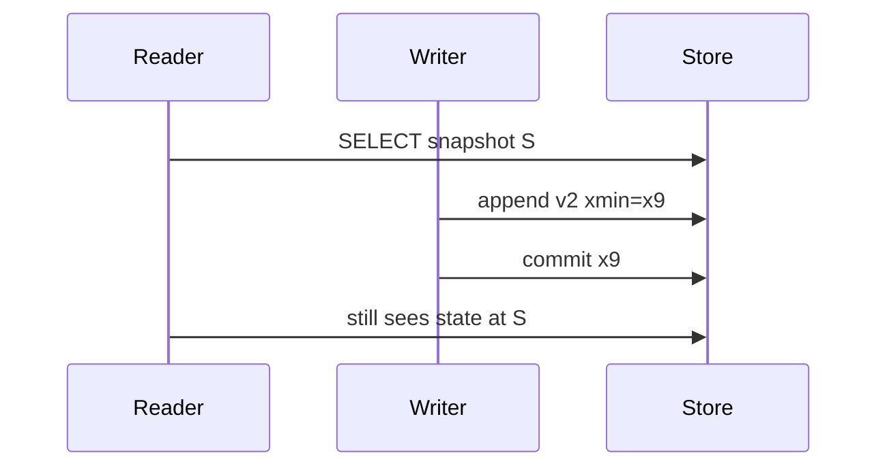

# Concurrency and Locking

## Overview

SQL.txt supports multiple concurrent API calls. Locking coordinates schema changes (DDL) vs data changes (DML) vs reads. **MVCC** (multi-version concurrency control) provides snapshot-consistent row visibility; **row locks** mediate write conflicts on the same key. Isolation defaults are documented per ADR-010.

## Before: single database RW lock (legacy mental model)

Historically, all mutating commands could serialize on one writer per database path, limiting throughput when different tables were updated concurrently.



## After: schema lock + per-table locks + MVCC

- **Schema exclusive lock** — `CREATE TABLE`, `CREATE INDEX`, `RebalanceTableAsync`, and other catalog / whole-DB structural operations hold a **database-path exclusive** lock (same coordinator key as legacy “full DB write”) so DDL cannot interleave with other DDL or with DML.
- **Per-table reader–writer locks** — `SELECT` acquires **shared** locks on referenced tables (unless `WITH (NOLOCK)`). `INSERT` / `UPDATE` / `DELETE` acquire **exclusive** locks on the target table and **shared** locks on **referenced parent tables** (FK validation), in **sorted table-name order** to avoid deadlocks.
- **MVCC** — Row versions carry `xmin` / `xmax` (transaction ids). Reads use a **snapshot** `xid` captured at statement start for committed data (see ADR-010). Writers append new versions; old versions are marked invalid.
- **Row locks** — In-memory exclusive locks keyed by `(databasePath, tableName, rowId)` for overlapping writes to the same logical row during commit (optional compatibility matrix with table locks).



### Lock compatibility (table-level RW)

|              | Read (shared) | Write (exclusive) |
|--------------|---------------|-------------------|
| **Read**     | Compatible    | Conflict          |
| **Write**    | Conflict      | Conflict          |

Schema exclusive conflicts with any table lock acquisition until released.

### Reader / writer under snapshot (MVCC)



## Phase 1 — Basic locking

- **Single mutex per database** — Evolved into **schema + table** layers (see above).
- **Readers block writers** — At **table** granularity: a **write** on a table blocks a **read** on that table unless `WITH (NOLOCK)` (which skips locks and allows torn / dirty reads).

## Phase 2 — Full lock manager

- **Per-database lock coordinator** — Single process coordinator: `IDatabaseLockManager` implementations hold **schema** and **per-table** `RwLockState` entries.
- **Read lock (shared)** — Multiple readers per table; blocks writers on that table.
- **Write lock (exclusive)** — Blocks readers and writers **on that table**.
- **FK-safe ordering** — Locks are acquired in **ascending table name** order (case-insensitive) for all tables in the lock set (parents for read, target for write). See ADR-009.

## WITH (NOLOCK)

SQL-like syntax for read-only queries:

```sql
SELECT * FROM Users WITH (NOLOCK);
```

- **Semantics:** Skip **table** read locks for `SELECT`.
- **Trade-off:** Faster; allows dirty reads and torn visibility relative to MVCC snapshot rules.
- **Use case:** Read-only reporting where approximate answers are acceptable.

## Interface (implemented contract)

```csharp
// Schema-wide exclusive (DDL, rebalance, etc.) — same path as historical "DB write"
await lockManager.AcquireWriteLockAsync(databasePath, cancellationToken);

// Table-scoped (DML / SELECT)
await lockManager.AcquireTableReadLocksAsync(databasePath, tableNames, cancellationToken);
await lockManager.AcquireTableWriteLocksAsync(databasePath, tableNames, cancellationToken);

// Ordered FK-safe helper: shared on parents, exclusive on targets
await lockManager.AcquireFkOrderedLocksAsync(
    databasePath, readTables, writeTables, cancellationToken);
```

`NOLOCK`: skip `AcquireTableReadLocksAsync` when the parser sets `WithNoLock` on `SelectCommand`.

## Lock scope summary

| Operation        | Schema lock | Table locks |
|------------------|------------|-------------|
| CREATE DATABASE  | No (path create) | No |
| CREATE TABLE / INDEX | Exclusive | — |
| REBALANCE        | Exclusive  | — |
| INSERT / UPDATE / DELETE | No (unless impl holds briefly) | FK-ordered read + write |
| SELECT           | No         | Shared on source table(s) |

## Integration

- Engine parses commands **without** holding locks, then acquires the appropriate **schema** or **table** set via `IDatabaseLockManager`.
- Lock manager is injected via constructor or defaults to `DatabaseLockManager`.
- Timeout and deadlock detection: optional future enhancement (ordering prevents classic deadlocks for FK DML).

## Isolation and MVCC

Default **READ COMMITTED**-style visibility using a **snapshot xid** at statement start is specified in [adr-010-mvcc-row-versions.md](../decisions/adr-010-mvcc-row-versions.md). **SERIALIZABLE** may add row-range behaviour in a later phase.

## Reference

- ADR-009: Table/schema locking and FK ordering.
- ADR-010: MVCC row versions, `xmin`/`xmax`, vacuum, pre-release format policy.
