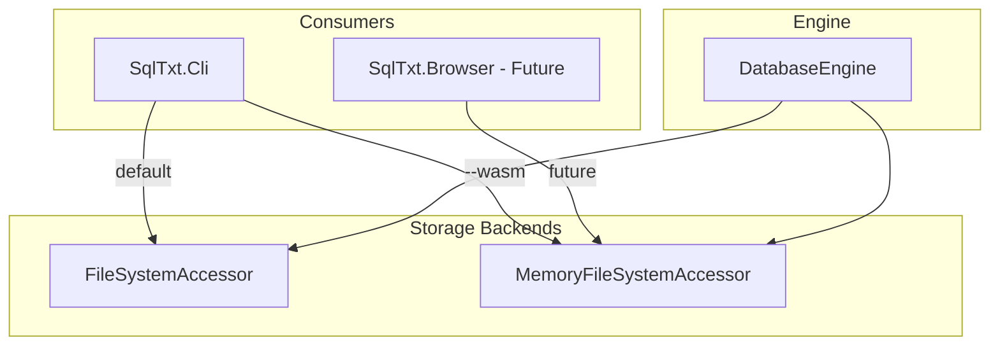

# WASM Storage

## Purpose

WASM-compatible storage enables SQL.txt to run in WebAssembly environments (e.g., browser apps). Because browsers do not expose a traditional filesystem, the engine uses an in-memory virtual filesystem that can be backed by IndexedDB or other browser storage APIs in the future.

## Current Implementation

### CLI `--wasm` Mode

When you specify `--wasm` with CLI commands, the engine uses:

- **MemoryFileSystemAccessor** — In-memory implementation of `IFileSystemAccessor` with normalized path keys (`/` separator)
- **PersistedMemoryFileSystemAccessor** — Wraps the memory store and persists to a JSON file (`.wasmdb`). Supports optional debounced persistence: when `debounceMs > 0`, saves are batched; call `Flush()` to force an immediate save. Useful for high-throughput INSERTs to reduce disk I/O.

This allows you to create and operate databases locally "as if in WebAssembly" — the same storage abstraction that would run in a browser.

### Path Semantics

- **create-db ./MyDb --wasm** — Creates virtual DB "MyDb", persists to `./MyDb.wasmdb`
- **exec --db ./MyDb.wasmdb --wasm** — Loads from file, runs command, saves back
- If path has no `.wasmdb` extension, it is appended automatically

### Persistence Format

The `.wasmdb` file is a JSON object mapping virtual file paths to content:

```json
{
  "WikiDb/db/manifest.json": "{...}",
  "WikiDb/Tables/User/User.txt": "A|1  Alice..."
}
```

Paths use `/` as separator and are normalized (`.` segments dropped). The virtual root matches the filename (e.g., `WikiDb` from `WikiDb.wasmdb`).

## Architecture



## Future: Browser Deployment

- **Blazor WebAssembly** — Host the engine in a Blazor WASM app
- **IndexedDB-backed storage** — Replace JSON file persistence with IndexedDB for real browser use
- **Shared format** — `.wasmdb` JSON structure could be imported/exported between CLI and browser

## Reference

- [CLI Reference](../cli-reference.md) — `--wasm` option and examples
- [Getting Started (WASM)](../getting-started/wasm.md) — Quick start for WASM mode
