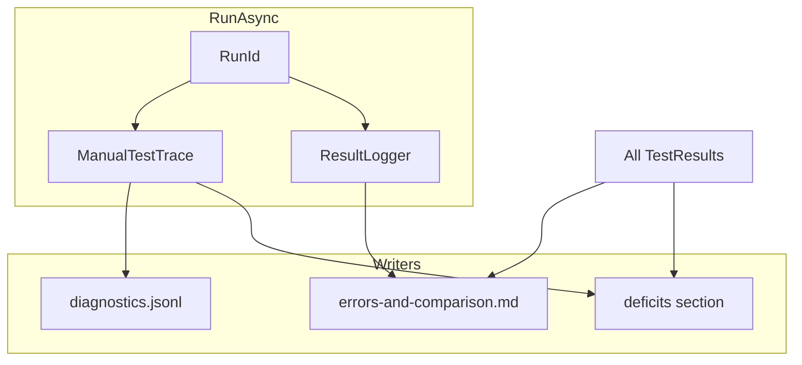

# Manual tests — harness reporting integration (Sub-plan 3)

## Purpose

Integrate **structured diagnostic sinks** with the existing manual-test harness so every run can emit **JSON Lines** (machine-readable timeline) and **deficit reports** (human-readable performance analysis vs **LocalDB** and **future named comparators**), using a **single RunId** correlated with the primary `.log` and [ManualTestIssuesReport](../../src/SqlTxt.ManualTests/Results/ManualTestIssuesReport.cs) output.

Depends on trace/event definitions in [ManualTest_Structured_Logging_And_Diagnostics.md](ManualTest_Structured_Logging_And_Diagnostics.md). User-facing procedures: [ManualTest_Docs_And_Agent_Rules.md](ManualTest_Docs_And_Agent_Rules.md).

## Goals

- **`ITestDiagnosticSink`** implementation(s): **in-memory ring buffer** + **append-only `*.diagnostics.jsonl`** per run (UTF-8, one JSON object per line).
- **`RunId`**: GUID (or `yyyyMMdd_HHmmss` + short id) generated once in [`ManualTestProgram.RunAsync`](../../src/SqlTxt.ManualTests/ManualTestProgram.cs), passed into `ResultLogger`, trace, and all report writers.
- Extend or complement **errors-and-comparison** Markdown:
  - Either new section **`## Application deficits {#deficits}`** in the same file, **or** sibling **`ManualTests_<ts>.deficits.md`**.
  - Content: for each **test name** and **comparator** (e.g. `localdb`), when SqlTxt (text/binary) **passed** but is **slower**, emit **absolute delta (ms)**, **ratio** (SqlTxt ÷ baseline), and **context** from trace (ops, row counts, shard count) when available.
- **Comparator abstraction**: report generator accepts `IReadOnlyList<ComparatorDefinition>` (Name, StorageLabel, e.g. `localdb`) so adding a second baseline DB later does not require rewriting tables.
- **`TestResult`** (optional enhancement): add `DiagnosticArtifactPath` or `RunId` on the record type in [TestResult.cs](../../src/SqlTxt.ManualTests/Results/TestResult.cs) so summary logging can print “see jsonl” without globbing.
- **CLI / exit codes**:
  - Existing: `--require-beat-localdb` (binary worse than LocalDB fails run).
  - Future: `--fail-on-deficit-ratio <r>` (e.g. fail if SqlTxt > 1.5× baseline)—specify in implementation PR.

## Non-goals

- Real-time dashboard or TCP streaming of events.
- Changing `dotnet test` unit-test behavior.

## Architecture

### JSONL event shape (minimum)

Each line is a JSON object; extend with versioning field `v: 1`.

| Field | Type | Notes |
|-------|------|--------|
| `v` | int | Schema version |
| `runId` | string | Correlation |
| `tsUtc` | string | ISO 8601 |
| `testName` | string? | When in test scope |
| `storageType` | string? | text/binary/localdb |
| `kind` | string | `stageStart`, `stageEnd`, `stepStart`, `stepEnd`, `counter`, `iterationError`, `assertFail` |
| `stage` | string? | Setup / Execute / Assert / Teardown |
| `step` | string? | e.g. Rebalance |
| `elapsedMs` | number? | On ends |
| `data` | object? | Flat string-keyed context |

### Deficits report logic

- **Inputs:** grouped `TestResult` by `TestName`, same as `ManualTestIssuesReport`.
- **Baseline:** comparator rows (`localdb`) vs SqlTxt rows (`text`, `binary`).
- **Eligible:** same rules as current “SLOWER” detection: both `Passed`, not skipped.
- **Output columns:** Test | Comparator | SqlTxt storage | SqlTxt ms | Baseline ms | Delta ms | Ratio | Context (from last trace snapshot or `Details`).

### Integration points

| Component | Change |
|-----------|--------|
| [ManualTestProgram.cs](../../src/SqlTxt.ManualTests/ManualTestProgram.cs) | Create `RunId`, construct trace + sink paths, dispose/flush at end |
| [ResultLogger.cs](../../src/SqlTxt.ManualTests/Results/ResultLogger.cs) | Accept optional `RunId`/sink reference; ensure correlation in headers |
| [ManualTestIssuesReport.cs](../../src/SqlTxt.ManualTests/Results/ManualTestIssuesReport.cs) | Add deficits section or call `ManualTestDeficitsReport.Write` |
| New | `DiagnosticJsonlSink.cs`, `ManualTestDeficitsReport.cs` (optional split) |

## File touch list

- `src/SqlTxt.ManualTests/ManualTestProgram.cs`
- `src/SqlTxt.ManualTests/Results/ResultLogger.cs`
- `src/SqlTxt.ManualTests/Results/ManualTestIssuesReport.cs`
- `src/SqlTxt.ManualTests/Results/TestResult.cs` (optional)
- New files under `src/SqlTxt.ManualTests/Diagnostics/` or `Results/`

## Rollout order

1. Add `RunId` + file path convention; write empty jsonl with header comment line or first `{v:1,kind:"runStart"}` event.
2. Wire `ManualTestTrace` to jsonl sink (Sub-plan 1).
3. Extend Markdown report with `#deficits` + comparator abstraction.
4. Optional CLI `--fail-on-deficit-ratio` and `TestResult` path fields.

## Definition of done (checklist)

- [ ] Single `RunId` appears in primary log header, jsonl events, and deficit/comparison MD front matter (YAML or bullet).
- [ ] `*.diagnostics.jsonl` written for a full `all --storage all` run when diagnostics flag is on (flag name as implemented).
- [ ] Deficits section (or file) lists ratio + delta for each slower SqlTxt vs LocalDB row, with anchor `#deficits`.
- [ ] Comparator list is data-driven (not only hard-coded `localdb` string in table builder).
- [ ] ManualTests README updated (cross-ref Sub-plan 2 doc tasks).

## References

- [ManualTest_Structured_Logging_And_Diagnostics.md](ManualTest_Structured_Logging_And_Diagnostics.md)
- [ManualTest_Docs_And_Agent_Rules.md](ManualTest_Docs_And_Agent_Rules.md)
