# Phase 2 Implementation Plan

This plan implements **Phase 2**: Indexes, PK/FK, constraints, relational metadata, full lock manager, WITH (NOLOCK), and SqlTxt.Service.

**Reference:** [docs/specifications/01_Initial_Creation.md](../specifications/01_Initial_Creation.md) (Phase 2 section, lines 888-1022)  
**Storage format:** [docs/architecture/02-storage-format.md](../architecture/02-storage-format.md)  
**SQL:2023 mapping:** [docs/architecture/11-sql2023-mapping.md](../architecture/11-sql2023-mapping.md)  
**Concurrency:** [docs/architecture/08-concurrency-and-locking.md](../architecture/08-concurrency-and-locking.md)  
**Efficiency:** [docs/architecture/10-performance-and-efficiency.md](../architecture/10-performance-and-efficiency.md)  
**ADR-004:** [docs/decisions/adr-004-api-service-nuget-concurrency.md](../decisions/adr-004-api-service-nuget-concurrency.md)  
**ADR-007:** [docs/decisions/adr-007-sharding-parameters.md](../decisions/adr-007-sharding-parameters.md)  
**ADR-008:** [docs/decisions/adr-008-index-shard-structure.md](../decisions/adr-008-index-shard-structure.md)

---

## Prerequisites

- Phase 1 complete
- Efficiency audit and implementation complete (ReadLinesAsync, StreamTransformRowsAsync, shard-aware writes)
- .NET 8 SDK
- Cross-platform: Windows, macOS, Linux

---

## Resolved Decisions

- **_RowId:** Introduce internal `_RowId` (immutable, not user-visible) for index targeting; survives row rewrites
- **UNIQUE constraints:** In scope for Phase 2
- **Index format:** `Value|ShardId|_RowId` per [adr-008](../decisions/adr-008-index-shard-structure.md); enables multi-shard; sorted for O(log n) lookup
- **STOC:** Shard Table of Contents (`<TableName>_STOC.txt`) — one line per shard; MinRowId, MaxRowId, FilePath, RowCount
- **Shard split:** Incremental index update only; add entries for rows moved to new shard; no full index rebuild
- **DefaultMaxShardSize:** Database default 20 MB in manifest; per-table override via `CREATE TABLE ... WITH (maxShardSize=...)`
- **Statistics metadata:** Reserve ~System slots for Phase 7; index format sorted to support future histogram building
- **FK behavior:** Prevent parent delete if dependents exist; no CASCADE in Phase 2
- **Service transport:** Defer to implementation; HTTP REST or named pipes

---

## Wave 1: Contracts and Schema Extensions

### 1.1 Extend TableDefinition and ColumnDefinition

- Add `PrimaryKeyColumns` (IReadOnlyList?) to TableDefinition
- Add `IsPrimaryKey`, `IsUnique` to ColumnDefinition (or derive from TableDefinition)
- Add `ForeignKeyDefinitions` (IReadOnlyList?) to TableDefinition
- Add `UniqueConstraintColumns` (IReadOnlyList?) for table-level UNIQUE

### 1.2 Add New Contract Types

- `ForeignKeyDefinition` (TableName, ColumnName, ReferencedTable, ReferencedColumn)
- `IndexDefinition` (IndexName, TableName, ColumnNames, IsUnique)
- `ConstraintViolationException` (already in Phase 1; extend for FK/PK/UNIQUE)

### 1.3 Add CreateIndexCommand

- `CreateIndexCommand` (IndexName, TableName, ColumnNames)

### 1.4 Row Format: _RowId

- Define `_RowId` as internal column; assign on INSERT (monotonic per table)
- Extend schema format to include _RowId in row serialization (e.g., prefix or first field after A|/D|)
- Document: _RowId is not user-visible; used only for index pointers

**Acceptance:** Contracts compile; TableDefinition supports PK, FK, UNIQUE, indexes.

---

## Wave 2: Parser Extensions

### 2.1 CREATE TABLE: PRIMARY KEY

- Parse `Id CHAR(10) PRIMARY KEY` (column-level)
- Parse `PRIMARY KEY (Id)` or `PRIMARY KEY (Id, Id2)` (table-level)

### 2.2 CREATE TABLE: FOREIGN KEY

- Parse `FOREIGN KEY (UserId) REFERENCES Users(Id)`

### 2.3 CREATE TABLE: UNIQUE

- Parse `UNIQUE` (column-level) and `UNIQUE (Col1, Col2)` (table-level)

### 2.4 CREATE INDEX

- Parse `CREATE INDEX IX_Users_Name ON Users(Name);`
- Parse `CREATE UNIQUE INDEX ...` if UNIQUE in scope

### 2.5 SELECT: WITH (NOLOCK)

- Parse `SELECT * FROM Users WITH (NOLOCK);`
- Add `WithNoLock` to SelectCommand

### 2.6 CREATE DATABASE/TABLE: Sharding Parameters

- Parse `CREATE DATABASE name WITH (defaultMaxShardSize=20971520);`
- Parse `CREATE TABLE name (...) WITH (maxShardSize=...);` for per-table override

**Acceptance:** Parser returns correct command types; invalid syntax throws ParseException.

---

## Wave 3: Storage — _RowId and Row Format

### 3.1 Row Format with _RowId

- Extend serialization: `A|_RowId|col1|col2|...` (or agreed format)
- _RowId: fixed-width (e.g., 20 chars for BIGINT); assign next value on INSERT
- Persist _RowId counter in table metadata or ~System
- Update FixedWidthRowSerializer, FixedWidthRowDeserializer
- **Efficiency:** Streaming reads/writes must handle _RowId; no full-table load for format change

### 3.2 Schema Persistence

- Extend schema format to store PrimaryKeyColumns, ForeignKeyDefinitions, UniqueConstraintColumns
- Backward compatibility: Phase 1 schemas without PK/FK/UNIQUE still load

### 3.3 Metadata Expansion

- Add key definitions, index definitions, relationship definitions to ~System or table metadata
- ROW_ID_SEQUENCE or equivalent for _RowId allocation

**Acceptance:** Rows include _RowId; schema persists PK/FK/UNIQUE; existing Phase 1 data migratable or new tables only.

---

## Wave 4: Storage — Index Files and STOC

### 4.1 Shard Table of Contents (STOC)

- `<TableName>_STOC.txt`: One line per shard: `ShardId|MinRowId|MaxRowId|FilePath|RowCount`
- Created when table has multiple shards; updated on shard split and rebalance
- Enables range-based lookups and incremental index maintenance

### 4.2 Index File Format

- `<TableName>_PK.txt`: `Value|ShardId|_RowId` per line (one entry per line)
- `<TableName>_FK_<ReferencedTable>.txt`: same format for FK index
- `<TableName>_INX_<Col1>_<Col2>_<N>.txt`: same for secondary indexes
- **Sorted** by Value for O(log n) binary search; human-readable
- ShardId = 0 for root file; 1, 2, ... for `<TableName>_1.txt`, `<TableName>_2.txt`, etc.

### 4.3 IIndexStore Interface

- `CreateIndexAsync`, `AddIndexEntryAsync(value, shardId, rowId)`, `LookupByValueAsync` (returns `(ShardId, RowId)[]`)
- `RebuildIndexAsync` (for integrity/corruption recovery)
- Index files in table folder per [02-storage-format.md](../architecture/02-storage-format.md)

### 4.4 Index Maintenance

- INSERT: add entry to PK index (and any other indexes) with current ShardId
- UPDATE: if indexed column changes, remove old entry, add new
- DELETE (soft): remove from indexes when row marked D|
- **Shard split:** Add new index entries only for rows moved to new shard; update STOC; no full rebuild
- **Efficiency:** Use streaming/append where possible; atomic writes (tmp + MoveFile)

**Acceptance:** Index files and STOC created and updated on INSERT/UPDATE/DELETE/split; format is human-readable.

---

## Wave 5: Engine — Primary Key Enforcement

### 5.1 CREATE TABLE with PK

- Validate PK columns exist; create PK index file on table creation
- For existing tables (migration): optional migration path or Phase 2 tables only

### 5.2 INSERT: PK Uniqueness

- Before insert: check PK index for duplicate; throw ConstraintViolationException if exists
- Add to PK index after successful insert

### 5.3 UPDATE: PK Uniqueness

- If SET changes PK column: check uniqueness before applying
- Update PK index (remove old, add new) when PK value changes

**Acceptance:** Duplicate PK rejected; PK index stays consistent.

---

## Wave 6: Engine — Foreign Key Enforcement

### 6.1 CREATE TABLE with FK

- Validate referenced table/column exist
- Create FK index file for child table (UserId -> _RowId of parent)
- Store FK definition in schema

### 6.2 INSERT/UPDATE: FK Validation

- On insert/update of FK column: lookup parent table PK index; throw if not found
- Maintain FK index (child value -> child _RowId) for reverse lookups

### 6.3 DELETE: FK Parent Check

- Before delete of parent row: check FK index of child tables for references to this _RowId
- Throw ConstraintViolationException if dependents exist
- No CASCADE in Phase 2

**Acceptance:** Invalid FK references rejected; parent delete blocked when children exist.

---

## Wave 7: Engine — UNIQUE Constraints

### 7.1 CREATE TABLE with UNIQUE

- Parse and store UNIQUE column(s)
- Create UNIQUE index file (same format as PK index)

### 7.2 INSERT/UPDATE: UNIQUE Enforcement

- Check UNIQUE index before insert/update
- Update UNIQUE index on change

**Acceptance:** Duplicate UNIQUE values rejected.

---

## Wave 8: Engine — CREATE INDEX and SELECT Optimization

### 8.1 CREATE INDEX

- Parse and execute CREATE INDEX
- Build index by scanning table (streaming), writing index file
- Register index in metadata

### 8.2 SELECT: Use Index When Applicable

- For `WHERE col = 'literal'` on indexed column: use index to get _RowIds, then fetch rows
- Fallback to table scan if no index or index not applicable
- **Efficiency:** Index lookup should be O(log n) or O(1) if sorted; avoid full scan when index exists

**Acceptance:** CREATE INDEX builds index; SELECT uses index for equality on indexed columns.

---

## Wave 9: Full Lock Manager and WITH (NOLOCK)

### 9.1 IDataLockManager Interface

- Replace or extend IDatabaseLockManager
- `AcquireReadLockAsync(table)`, `AcquireWriteLockAsync(table)`, `ReleaseLockAsync()`
- Reader-writer semantics: multiple readers; writers exclusive

### 9.2 Implement Reader-Writer Lock

- Per-table or per-database lock scope (per spec: per-table for finer granularity)
- Multiple concurrent readers; single writer

### 9.3 WITH (NOLOCK)

- When SelectCommand has WithNoLock: skip AcquireReadLock
- Document: allows dirty reads; use for read-only reporting

**Acceptance:** Multiple concurrent SELECTs; writers block readers; NOLOCK skips lock.

---

## Wave 10: SqlTxt.Service

### 10.1 Service Host

- SqlTxt.Service exists (Worker template); implement as long-running host
- Accept database path via configuration (e.g., appsettings.json, environment)
- Open database on startup; keep Engine instance

### 10.2 Transport

- Implement HTTP REST API (minimal): POST /exec, POST /query
- Or named pipes / gRPC per ADR-004 deferral
- Recommendation: HTTP REST for simplicity and cross-platform

### 10.3 Endpoints

- `POST /exec` — body: `{ "sql": "INSERT INTO ..." }`; returns rows affected
- `POST /query` — body: `{ "sql": "SELECT ..." }`; returns rows
- `POST /rebalance/{tableName}` — rebalance shards for table; redistributes rows
- Health check endpoint

**Acceptance:** Service runs; accepts exec/query/rebalance; returns results.

---

## Wave 10.5: Rebalance API

### 10.5.1 Engine

- Add `RebalanceTableAsync(string tableName)` to IDatabaseEngine
- Scans all shards; redistributes rows to balance shard sizes
- Updates STOC and indexes

### 10.5.2 CLI

- `sqltxt rebalance --db ./Db --table Users`

### 10.5.3 Service

- `POST /rebalance/{tableName}` (or include in Wave 10.3)

**Acceptance:** Rebalance redistributes rows; STOC and indexes updated; exposed via Engine, CLI, Service.

---

## Wave 11: Tests

### 11.1 Unit Tests

- Parser: PK, FK, UNIQUE, CREATE INDEX, WITH (NOLOCK)
- Storage: _RowId format, index file read/write
- Engine: PK uniqueness, FK validation, UNIQUE, index usage

### 11.2 Integration Tests

- Create table with PK, insert duplicate (reject)
- Create tables with FK, insert invalid ref (reject), delete parent with children (reject)
- CREATE INDEX, SELECT with WHERE on indexed column (verify index used)
- WITH (NOLOCK) concurrent read

### 11.3 Service Tests

- HTTP client calls exec/query; verify response

**Acceptance:** All tests pass; coverage for new paths.

---

## Wave 12: Hardening and Documentation

### 12.1 Error Messages

- ConstraintViolationException: clear message (duplicate PK, FK violation, etc.)
- File name, row, position when applicable

### 12.2 Sample Wiki Update

- Add PK to User.Id, Page.Id, etc. in create-wiki.sql
- Add FK where appropriate (e.g., Page.CreatedById -> User.Id)
- Rebuild sample; verify

### 12.3 Docs Update

- Getting Started, CLI Reference, API docs
- Phase 2 features: PK, FK, UNIQUE, CREATE INDEX, WITH (NOLOCK)
- Service deployment (Windows Service, systemd, launchd)

**Acceptance:** Docs current; sample Wiki uses Phase 2 features.

---

## Phase 2 Complete Checklist

- All waves 1-12 complete (including Wave 10.5 Rebalance)
- `dotnet build` succeeds
- `dotnet test` passes
- Sample Wiki with PK/FK builds and runs
- Service runs and accepts exec/query
- README and docs updated

---

## Step 13: Phase 3 Plan Prompt

When Phase 2 is complete, use the following prompt to generate the Phase 3 implementation plan:

> **Prompt:** Using the plan at `docs/plans/Phase2_Implementation_Plan.md` and the specs in `docs/specifications/01_Initial_Creation.md` (Phase 3 section), create a new Phase 3 implementation plan.
>
> The plan should:
>
> - Be saved to `docs/plans/Phase3_Implementation_Plan.md`
> - Follow the same format: each step as a referencable item with a checkbox
> - Cover: VARCHAR, variable-width fields, storage evolution
> - Include concrete acceptance criteria per wave
> - Reference Phase 3 requirements from the spec
> - End with a step to prompt for the next phase when Phase 3 is complete

---

## Diagram: Phase 2 Data Flow

```mermaid
flowchart TB
    subgraph CreateTable [CREATE TABLE with PK/FK/UNIQUE]
        CMD[CreateTableCommand]
        CMD --> VAL[Validate PK/FK cols]
        VAL --> SCHEMA[Write schema + key defs]
        SCHEMA --> PKIDX[Create _PK.txt]
        SCHEMA --> FKIDX[Create _FK_*.txt]
    end

    subgraph Insert [INSERT]
        INS[InsertCommand]
        INS --> PKCHECK[PK index lookup]
        PKCHECK -->|duplicate| REJECT[ConstraintViolation]
        PKCHECK -->|ok| FKCHECK[FK parent exists]
        FKCHECK -->|ok| WRITE[Append row + _RowId]
        WRITE --> IDXUPDATE[Update all indexes]
    end

    subgraph Select [SELECT with optional index]
        SEL[SelectCommand]
        SEL --> IDX{Index on WHERE col?}
        IDX -->|yes| LOOKUP[Index lookup _RowIds]
        IDX -->|no| SCAN[Table scan]
        LOOKUP --> FETCH[Fetch rows by _RowId]
        SCAN --> STREAM[Stream rows]
    end
```

---

## Efficiency Notes

- Index builds: use streaming scan; write index via StreamWriter or StringBuilder per [10-performance-and-efficiency.md](../architecture/10-performance-and-efficiency.md)
- FK checks: index lookup is O(n) for one-entry-per-line; consider sort for binary search in future
- Lock manager: avoid blocking; use async lock acquisition
