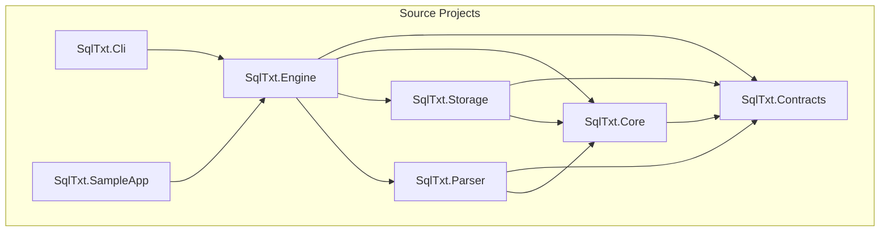

# SQLTxt Stage 0 — Project Setup Plan

This plan establishes the full project foundation for **SQL.txt**, a lightweight, embeddable .NET database engine that persists data in human-readable text files. No functional code is created; only scaffolding, guidance, and documentation.

**Reference:** [docs/specs/01_Initial_Creation.md](../specs/01_Initial_Creation.md)

---

## Prerequisites

- .NET 8 SDK
- Visual Studio 2022 or VS Code with C# extension
- Cursor IDE (for AI-assisted development)

---

## Step 1: Create Directory Structure

- [ ] **1.1** Create `src/` with subdirectories: `SqlTxt.Contracts`, `SqlTxt.Core`, `SqlTxt.Storage`, `SqlTxt.Parser`, `SqlTxt.Engine`, `SqlTxt.Cli`, `SqlTxt.SampleApp`
- [ ] **1.2** Create `tests/` with subdirectories: `SqlTxt.Core.Tests`, `SqlTxt.Storage.Tests`, `SqlTxt.Parser.Tests`, `SqlTxt.Engine.Tests`, `SqlTxt.IntegrationTests`
- [ ] **1.3** Create `docs/plans/`, `docs/architecture/`, `docs/specifications/`, `docs/prompts/`, `docs/decisions/`, `docs/examples/`
- [ ] **1.4** Create `docs/plans/` and save this plan as `docs/plans/Stage0_Setup_Plan.md`

---

## Step 2: Create Root Build Configuration

- [ ] **2.1** Add `global.json` targeting .NET 8
- [ ] **2.2** Add `Directory.Build.props` with shared MSBuild properties (LangVersion, Nullable, TreatWarningsAsErrors, etc.)
- [ ] **2.3** Add `Directory.Build.targets` if needed for shared targets (e.g., test coverage, analyzers)

---

## Step 3: Create Visual Studio Solution and Projects

- [ ] **3.1** Create `SqlTxt.sln` at repository root
- [ ] **3.2** Add `SqlTxt.Contracts` (.NET 8 class library) — no dependencies
- [ ] **3.3** Add `SqlTxt.Core` (.NET 8 class library) — references `SqlTxt.Contracts`
- [ ] **3.4** Add `SqlTxt.Storage` (.NET 8 class library) — references `SqlTxt.Contracts`, `SqlTxt.Core`
- [ ] **3.5** Add `SqlTxt.Parser` (.NET 8 class library) — references `SqlTxt.Contracts`, `SqlTxt.Core`
- [ ] **3.6** Add `SqlTxt.Engine` (.NET 8 class library) — references `SqlTxt.Contracts`, `SqlTxt.Core`, `SqlTxt.Storage`, `SqlTxt.Parser`
- [ ] **3.7** Add `SqlTxt.Cli` (.NET 8 console app) — references `SqlTxt.Engine`
- [ ] **3.8** Add `SqlTxt.SampleApp` (.NET 8 console app) — references `SqlTxt.Engine`
- [ ] **3.9** Add all project folders to solution with correct folder grouping (src/, tests/)

---

## Step 4: Add Test Projects

- [ ] **4.1** Add `SqlTxt.Core.Tests` (xUnit) — references `SqlTxt.Core`
- [ ] **4.2** Add `SqlTxt.Storage.Tests` (xUnit) — references `SqlTxt.Storage`
- [ ] **4.3** Add `SqlTxt.Parser.Tests` (xUnit) — references `SqlTxt.Parser`
- [ ] **4.4** Add `SqlTxt.Engine.Tests` (xUnit) — references `SqlTxt.Engine`
- [ ] **4.5** Add `SqlTxt.IntegrationTests` (xUnit) — references `SqlTxt.Engine`
- [ ] **4.6** Add placeholder test classes (e.g., `PlaceholderTests.cs`) so projects build

---

## Step 5: Create Cursor Guidance Rules

Create `.cursor/rules/` and add the following `.mdc` rule files:

- [ ] **5.1** `sql-txt-project-overview.mdc` — `alwaysApply: true` — Project purpose, layered architecture, project responsibilities, key interfaces
- [ ] **5.2** `csharp-sql-txt-standards.mdc` — `globs: **/*.cs` — C# conventions for this project (async, error handling, immutability)
- [ ] **5.3** `sql-txt-contracts.mdc` — `globs: src/SqlTxt.Contracts/**/*.cs` — Contract models, interfaces, exception hierarchy
- [ ] **5.4** `sql-txt-storage.mdc` — `globs: src/SqlTxt.Storage/**/*.cs` — Storage layer, file formats, directory layout
- [ ] **5.5** `sql-txt-parser.mdc` — `globs: src/SqlTxt.Parser/**/*.cs` — Parser design, tokenizer, SQL subset
- [ ] **5.6** `sql-txt-engine.mdc` — `globs: src/SqlTxt.Engine/**/*.cs` — Engine execution, command handling
- [ ] **5.7** `sql-txt-testing.mdc` — `globs: tests/**/*.cs` — Test strategy, golden files, integration test patterns

---

## Step 6: Create `AGENTS.md` (Cursor Agent Instructions)

- [ ] **6.1** Create `AGENTS.md` at repository root with:
  - Project context and goals
  - Phased development approach (Stage 0, Phase 1, 2, 3)
  - Prompt strategy: break work into small, testable chunks
  - Reference to `docs/specs/01_Initial_Creation.md` and `docs/prompts/`
  - Instructions to avoid "build the whole engine" prompts; use bounded tasks

---

## Step 7: Create Architecture Documentation

- [ ] **7.1** Create `docs/architecture/01-system-architecture.md` — Projects, dependencies, layering, storage design, parser design
- [ ] **7.2** Create `docs/architecture/02-storage-format.md` — Directory layout, file naming, schema/metadata/data formats, versioning
- [ ] **7.3** Create `docs/architecture/03-sql-subset.md` — Supported syntax by phase, reserved words, parsing assumptions
- [ ] **7.4** Create `docs/architecture/04-testing-strategy.md` — Unit, integration, golden file tests

---

## Step 8: Create Specification and Decision Docs

- [ ] **8.1** Create `docs/specifications/00-product-spec.md` — Purpose, scope, phased roadmap, user stories, constraints
- [ ] **8.2** Create `docs/decisions/adr-001-human-readable-storage.md` — ADR for human-readable storage choice

---

## Step 9: Create Prompt Templates

- [ ] **9.1** Create `docs/prompts/phase-1-cursor-prompts.md` — Cursor-ready prompts for each Phase 1 wave (e.g., Solution Scaffold, Contracts, Storage, Parser, Engine, Update/Delete, Tests)

---

## Step 10: Create Example Database Layout

- [ ] **10.1** Create `docs/examples/database-directory-layout.md` — Example directory structure with `db.manifest.json`, `system/`, `tables/` per spec

---

## Step 11: Create Full README.md

- [ ] **11.1** Replace current `README.md` with full content (see below)

---

## Step 12: Verify Build and Structure

- [ ] **12.1** Run `dotnet build` to verify solution builds
- [ ] **12.2** Run `dotnet test` to verify test projects execute (placeholder tests pass)

---

## Step 13: Phase 1 Plan Prompt

- [ ] **13.1** Use the following prompt to generate the Phase 1 implementation plan:

> **Prompt:** Using the plan at `docs/plans/Stage0_Setup_Plan.md` and the specs in `docs/specs/01_Initial_Creation.md`, create a new Phase 1 implementation plan.
>
> The plan should:
> - Be saved to `docs/plans/Phase1_Implementation_Plan.md`
> - Follow the same format: each step as a referencable item with a checkbox
> - Cover the Phase 1 waves: Solution Foundation, Storage Foundation, Parser v1, Core Engine v1, Update/Delete, CLI/Consumer App, Hardening
> - Include concrete acceptance criteria per wave
> - Reference the Cursor prompts in `docs/prompts/phase-1-cursor-prompts.md`
> - End with a step to prompt for the Phase 2 plan when Phase 1 is complete

---

## Dependency Diagram

